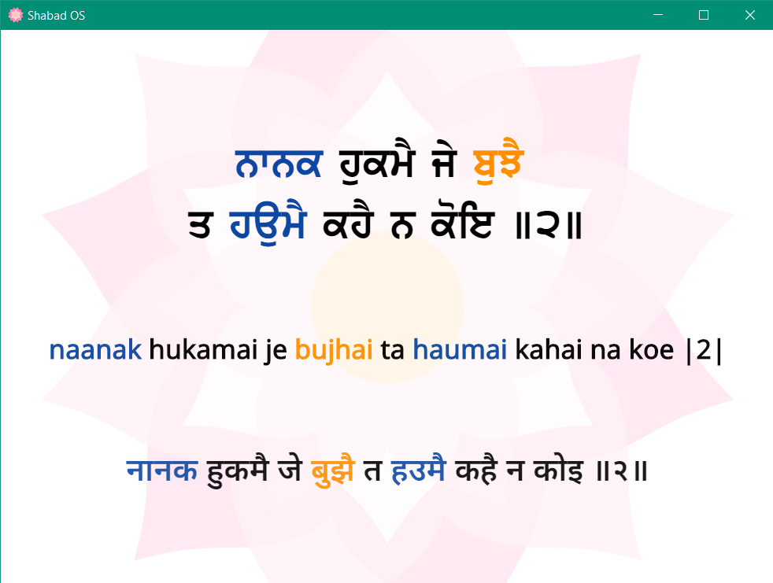

:repo: brand
:project: Shabad OS Brand
:idprefix:
:hide-uri-scheme:
:numbered:
:max-width: 900px
:icons: font
:toc: macro
:toclevels: 4
:logo: https://raw.githubusercontent.com/ShabadOS/desktop/dev/resources/icon.png
:website: https://shabados.com
:instagram-img: https://img.shields.io/badge/Instagram-%40shabad__os-C13584.svg?logo=instagram&logoColor=white
:instagram-url: https://www.instagram.com/shabad_os/
:twitter-img: https://img.shields.io/badge/Twitter-%40shabad__os-1DA1F2.svg?logo=twitter&logoColor=white
:twitter-url: https://www.twitter.com/shabad_os/
:chat-img: https://img.shields.io/badge/Chat-Public%20Slack%20Channels-1264a3.svg?logo=slack
:chat-url: https://chat.shabados.com
ifdef::env-github,env-browser[:outfilesuffix: .asciidoc]
ifdef::env-github[]
:note-caption: :information_source:
:tip-caption: :bulb:
:important-caption: :fire:
:caution-caption: :warning:
:warning-caption: :no_entry:
endif::[]

image::{logo}[128,128,link="{website}"]

[discrete]
# {project}

Assets for unifying Shabad OS across various platforms.

---
toc::[id="toc"]
---

## Introduction

The Shabad OS Brand helps unify Shabad OS related projects across various platforms such as the desktop and mobile app, the website, documentation, and tutorials, and also the various social media accounts (e.g. instagram and twitter).

The assets should only be used in relation to Shabad OS. If in doubt, <<Community,please reach out>> and ask for permission.

### Screenshots

image::assets/readme/screenshot-db-viewer-brand.png[width=640]
image::assets/readme/screenshot-youtube-channel-art.png[width=640]

### Community

Get updates on Shabad OS and chat with the project maintainers and community members.

* image:{instagram-img}[title=Instagram, link="{instagram-url}"] Follow Shabad OS on Instagram. 
* image:{twitter-img}[title=Twitter, link="{twitter-url}"] Follow Shabad OS on Twitter. 
* image:{chat-img}[title=Chat, link="{chat-url}"] Join the official Slack channel. 

## Logo

The strongest connection to Shabad OS related projects is the logo consisting of a pink lotus flower and the words Shabad OS. The logo is provided as an SVG. A plain white color or radial gradient should be used with the lotus flower when needing more contrast from a busy background.

|===
| Key | Value

| Icon
| Lotus Flower SVG

| Icon BG
| none, #ffffff, or #ba1e62 → #300519

| Font Family
| Noto Sans

| Font Weight
| 100/200 (Thin/Ultra-Light)
|===

## Lotus Icon

The icon comes as an SVG and was created in a free, open-source vector program called https://inkscape.org/[Inkscape].

### Colors

From a branding perspective, the closer to the original pink lotus flower colors used, the better. However, in some cases there are variations of the petal colors used. By default, in terms of color, there are 5 layers to the lotus icon:

|===
| Layer | Hex Code (#) | Opacity (%)

| Inner Circle
| ffbd5f
| 100

| Inner Front Petals
| ffb7d0
| 54.9

| Inner Base Petals
| ffe3ec
| 100

| Outer Front Petals
| ff86b1
| 74.1

| Outer Base Petals
| ff4f91
| 74.1
|===

### Proportions

Assuming the end resulting mask (viewable icon area including background) is 72 x 72 dp, the lotus icon, horizontally from left most petal point to right most petal point, should be 52 x 52 dp.

NOTE: The radial background used on mobile apps (for consistency) assumes a 108 x 108 dp area with the center of the radius beginning at the bottom of the square and extending up to the top-most point of the inner front petals. This was done to keep the look of icons consistent between Android and iOS. This is subject to change after further testing.

The Page Size of the icon can be changed through Inkscape's menu `File > Document Properties...`. When changing page size, make sure all elements are centered using the `Align and Distribute` tool (center aligning relative to Page both horizontally and vertically). Also make sure when exporting that the Export Area is set to "Page". Here is a table of which page sizes to use for which format.

|===
| Page Size | End Platform

| 52 x 52 dp
| Should only be used to show the lotus only (E.g. website favicon)

| 72 x 72 dp
| Social Media / iOS App Icon

| 108 x 108 dp
| Android App Icon
|===

## Desktop Backgrounds

The lotus icon is used in many themes for desktop as a backdrop. These images can be found in the `wallpapers` folder and are to be exported to 2160 x 2160 px PNG files.

## Feedback

* Ask a question via {chat-url}[Slack] or {wa-url}[WhatsApp]
* link:https://github.com/ShabadOS/{repo}/issues/new[Submit an issue] on our issue tracker
* Follow {instagram-url}[@shabad_os on Instagram] and {twitter-url}[@shabad_os on Twitter] and let us know what you think!

## Related Projects

Branded projects in the Shabad OS ecosystem of free and open source software include:

* link:https://github.com/ShabadOS/desktop[Desktop] 
* link:https://github.com/ShabadOS/mobile[Mobile]
